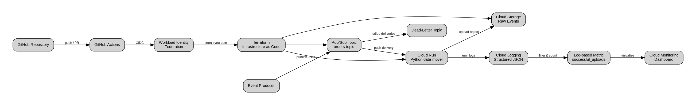
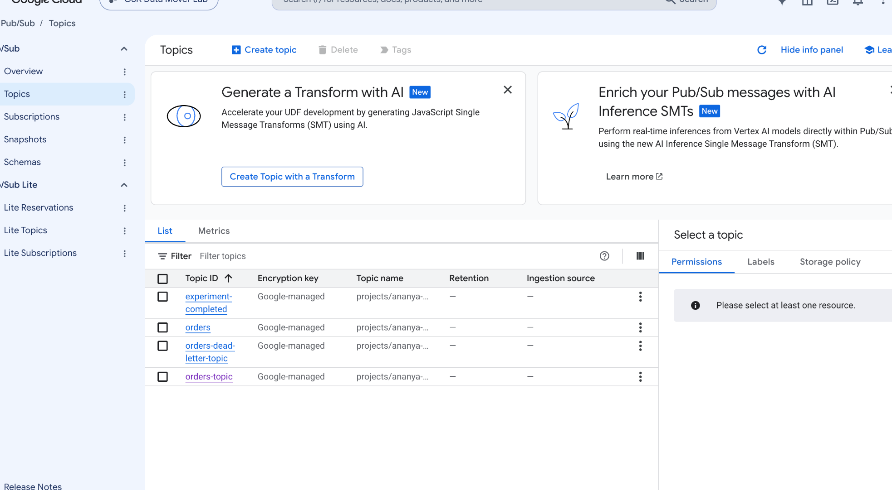
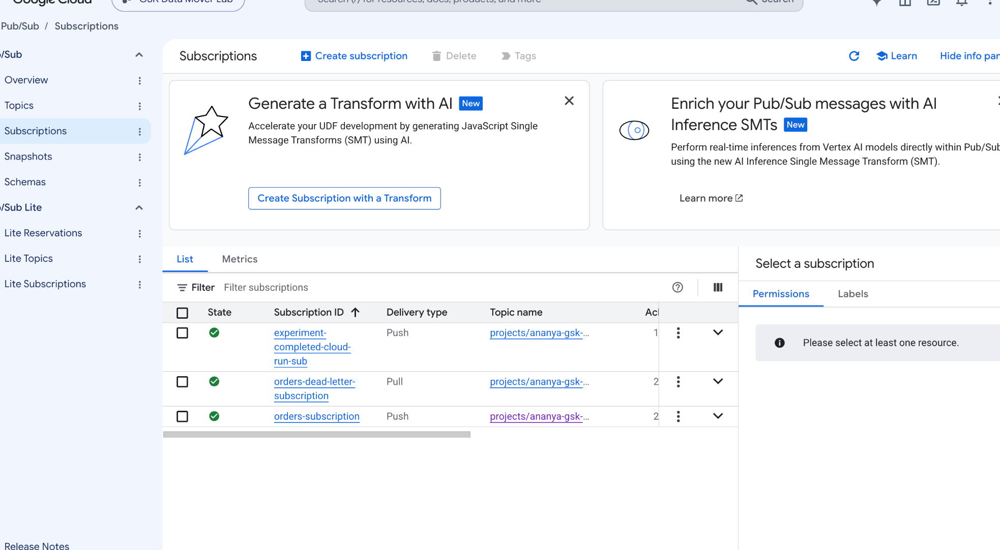
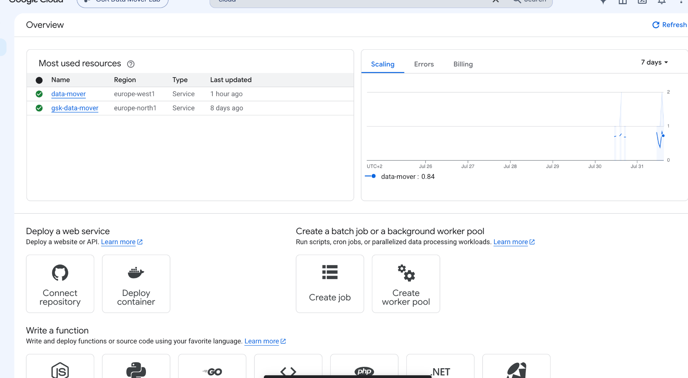
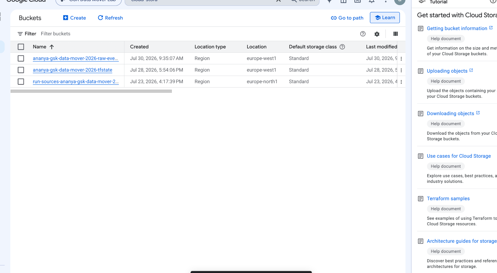
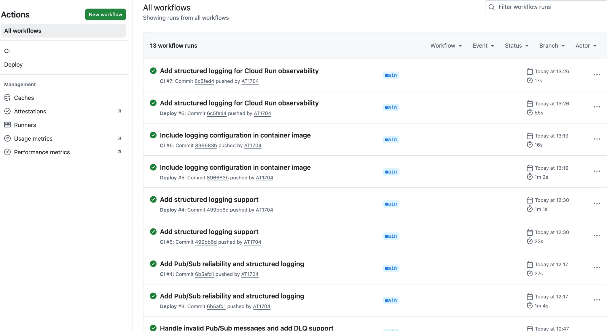
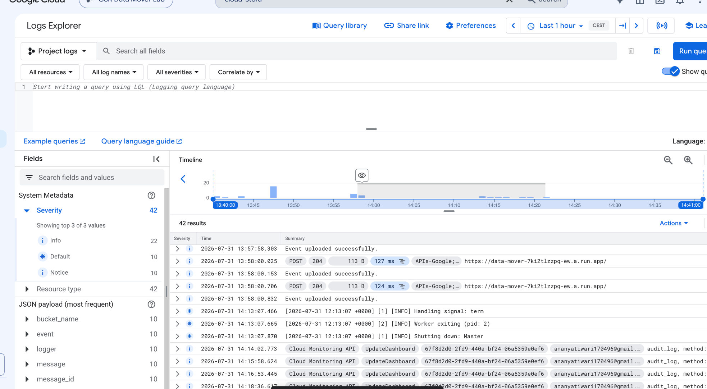
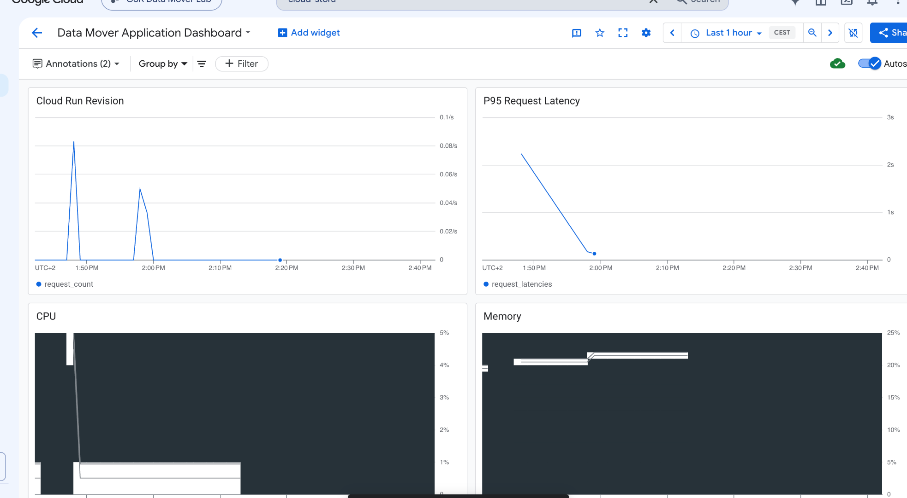
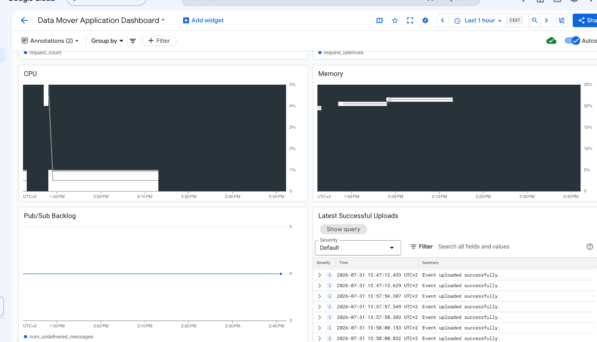

<div align="center">

# 🚀 GCP Event-Driven Data Mover

### Production-Grade Event-Driven Data Pipeline on Google Cloud Platform

A serverless event-driven application built using **Google Cloud Pub/Sub**, **Cloud Run**, **Cloud Storage**, **Terraform**, **GitHub Actions**, and **Cloud Monitoring**.

[]()
[]()
[]()
[]()
[]()

</div>

---

# 📖 Overview

This project demonstrates how to design, provision, deploy, and monitor a **production-style event-driven architecture** on **Google Cloud Platform (GCP)**.

Incoming JSON events are published to **Google Cloud Pub/Sub**, automatically delivered to a **Cloud Run** service through a Push Subscription, processed by a Python application, and stored in **Google Cloud Storage**.

The complete infrastructure is provisioned using **Terraform**, while deployments are automated through **GitHub Actions** using **Workload Identity Federation**, enabling secure keyless authentication.

To improve reliability and operational visibility, the solution also includes:

- Event-driven serverless architecture
- Infrastructure as Code (Terraform)
- Automated CI/CD pipeline
- Dead Letter Queue (DLQ)
- Structured JSON Logging
- Log-based Metrics
- Cloud Monitoring Dashboard
- Unit Testing with Pytest

---

# 🏗 Architecture

<p align="center">

</p>

---

# 🔄 End-to-End Workflow

```text
Publisher
    │
    ▼
Pub/Sub Topic
    │
Push Subscription
    │
    ▼
Cloud Run (Python)
    │
Validate Request
    │
Upload JSON File
    ▼
Cloud Storage
    │
    ▼
Structured Logging
    │
Cloud Logging
    │
    ▼
Cloud Monitoring Dashboard

Failures
    │
Retry
    │
Dead Letter Topic
```

---

# ✨ Features

- Event-Driven Architecture
- Serverless Processing using Cloud Run
- Infrastructure as Code with Terraform
- GitHub Actions CI/CD
- Workload Identity Federation (Keyless Authentication)
- Pub/Sub Push Subscriptions
- Automatic Retry Handling
- Dead Letter Queue (DLQ)
- Structured JSON Logging
- Cloud Monitoring Dashboard
- Python Unit Tests

---

# 🛠 Technology Stack

| Category | Technology |
|------------|------------|
| Language | Python 3.12 |
| Cloud Platform | Google Cloud Platform |
| Compute | Cloud Run |
| Messaging | Cloud Pub/Sub |
| Storage | Cloud Storage |
| Infrastructure | Terraform |
| CI/CD | GitHub Actions |
| Authentication | Workload Identity Federation |
| Monitoring | Cloud Monitoring |
| Logging | Cloud Logging |
| Testing | Pytest |

---

# 📂 Repository Structure

```text
.
├── app/
│   ├── main.py
│   ├── logging_config.py
│   ├── requirements.txt
│   └── Dockerfile
│
├── terraform/
│
├── tests/
│
├── docs/
│   ├── architecture.png
│   ├── cloud-run.png
│   ├── dashboard-overview.png
│   ├── dashboard-operations.png
│   ├── github-actions.png
│   ├── logs.png
│   ├── storage.png
│   ├── subscriptions.png
│   └── topics.png
│
├── .github/
│   └── workflows/
│
└── README.md
```

---

# ☁ Infrastructure

Infrastructure is provisioned entirely using **Terraform**.

The project creates and manages:

- Cloud Run Service
- Pub/Sub Topics
- Push Subscription
- Dead Letter Topic
- Dead Letter Subscription
- Cloud Storage Bucket
- IAM Roles
- Service Accounts

---

## Pub/Sub Topics

Three Pub/Sub topics are provisioned to support reliable event processing.

- **orders-topic** – Primary topic for incoming events.
- **orders-dead-letter-topic** – Stores messages that exceed retry attempts.
- **experiment-completed** – Development/testing topic.

<p align="center">

</p>

---

## Pub/Sub Subscriptions

Push subscriptions automatically invoke the Cloud Run service.

Failed events are redirected to the Dead Letter Queue for later inspection.

<p align="center">

</p>

---

## Cloud Run

The Cloud Run service validates incoming events, uploads JSON objects to Cloud Storage, and emits structured logs for observability.

<p align="center">

</p>

---

## Cloud Storage

Successfully processed events are stored as JSON files inside a Cloud Storage bucket.

<p align="center">

</p>

---

# 🚀 Continuous Integration & Deployment

The application uses **GitHub Actions** for automated deployments.

Every push to the **main** branch performs:

- Terraform Validation
- Python Unit Tests
- Docker Image Build
- Cloud Run Deployment

Authentication is securely handled using **Workload Identity Federation**, eliminating the need for long-lived service account keys.

<p align="center">

</p>

---

# 📊 Observability

The project includes end-to-end observability using **Cloud Logging** and **Cloud Monitoring**.

---

## Structured Logging

Each processed event generates structured JSON logs containing:

- Event Name
- Message ID
- Bucket Name
- Object Name
- Payload Size
- Processing Time

Example query:

```text
resource.type="cloud_run_revision"
resource.labels.service_name="data-mover"
jsonPayload.event="event_uploaded"
```

<p align="center">

</p>

---

## Monitoring Dashboard

A Cloud Monitoring dashboard provides operational visibility into the application.

### Performance Metrics

Tracks:

- Request Count
- P95 Request Latency
- CPU Utilization
- Memory Utilization

<p align="center">

</p>

---

### Operational Metrics

Tracks:

- Pub/Sub Backlog
- Latest Successful Uploads
- Processing Activity

<p align="center">

</p>

---

# 🧪 Running Tests

Execute all unit tests:

```bash
pytest -v
```

Publish a sample event:

```bash
gcloud pubsub topics publish orders-topic \
--message='{"order_id":"123","status":"created"}'
```

---

# 🚀 Deployment

Initialize Terraform:

```bash
terraform init
```

Validate configuration:

```bash
terraform validate
```

Preview infrastructure changes:

```bash
terraform plan
```

Provision infrastructure:

```bash
terraform apply
```

Deploy the application:

Simply push to the **main** branch.

GitHub Actions automatically builds and deploys the latest version to Cloud Run.

---

# 🔒 Security

This project follows Google Cloud security best practices.

- Workload Identity Federation
- No Service Account Keys
- Least Privilege IAM
- Dedicated Runtime Service Account
- Private Cloud Storage Bucket
- Infrastructure managed using Terraform

---

# 📈 Future Improvements

- OpenTelemetry Tracing
- Secret Manager Integration
- Multi-Environment Deployment
- Artifact Registry Vulnerability Scanning
- Integration Testing
- Cloud Armor
- Alert Policies
- SLO & Error Budget Monitoring

---

# 🎯 Skills Demonstrated

- Event-Driven Architecture
- Serverless Computing
- Infrastructure as Code
- CI/CD Automation
- Google Cloud Platform
- Cloud Security
- Cloud Monitoring
- Cloud Logging
- Reliability Engineering
- Python Backend Development
- Terraform

---

# ⭐ Support

If you found this project useful, consider giving it a ⭐ on GitHub.

It helps others discover the project and motivates future improvements.

---

# 📄 License

This project is licensed under the MIT License.
